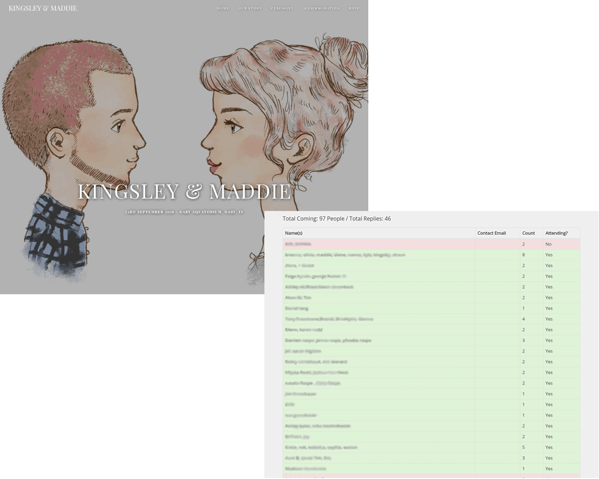

# Your RSVP Website
> Nice and easy wedding RSVP website (with password protected list view)

[](https://travis-ci.org/kingsloi/kingsleyandqueensley.com)

I got married earlier this year and wanted to automate as much as I could. The wife and I were dreading the invitations and then keeping track of who was/wasn't coming. I bought a template ([Union - Wedding Template](https://themeforest.net/item/union-wedding-template-with-page-builder/10450812)), customised it. I wasn't happy with the amount of JS in it, so I integrated Vue 2.0 for the frontend, and Laravel's Lumen for a backend API. It's a bit overkill, but tried to keep it as simple as possible, rather than as fast as possible.



## Installation

```sh
git clone https://github.com/kingsloi/kingsleyandqueensley.com.git .
composer install
gulp
```
### View RSVPs
Go to {YOUR_URL}/who?password=`PASSWORD`

## Development setup

 * Once pulled, set your wedding-specific data in `config/wedding.php`.
 * Make necessary SCSS / Vue edits

### Compile:
```sh
gulp
```

### Testing
```sh
vendor/bin/phpunit
```

## Release History

* 1.0.0
    * Initial Commit

## Meta

Originally from Theme Forest - [Union - Wedding Template](https://themeforest.net/item/union-wedding-template-with-page-builder/10450812). Edited to fit my needs. CSS/HTML not necessarily by me.

Kingsley Raspe – [kingsley.raspe@googlemail.com](mailto:kingsley.raspe@googlemail.com) - [LinkedIn](https://www.linkedin.com/in/kingsleyraspe)

Distributed under the MIT license. See ``LICENSE`` for more information.